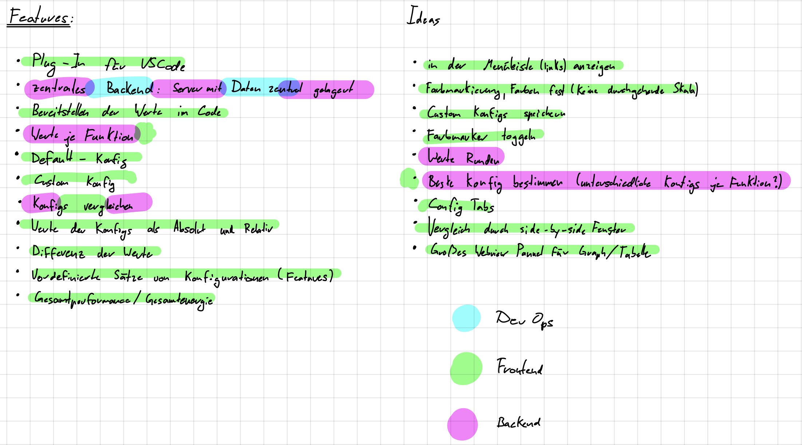

#SWE Meeting
2021-12-21

Ferris, Jonas, Louis, Maxim L, Richard, Yannick, Maxim Z

#### Organisation
- Auf festes Gebiet spezialisieren
- Backend usw. auch in Angriff zu nehmen
- Gebiete konkreter einhalten
- Weniger Meetings bzw. weniger zu Besprechen —> unnötig
- trotzdem ein Meeting pro Woche
- Nicht jede Zeile Code erklären
- Teamübergreifende Features untereinander besprechen
- Issues anderer Teams im Auge behalten
- Sprints gut planen und abarbeiten (Issues besonders)

#### Frontend TODOs
- Find Kanzi-Methods from list
- Text Highlighting
- Config aus Webview übergeben
- Window zu Side Panel umbauen
- Knöpfe zum starten, aktivieren usw.
- Checkboxen als scrollbare Liste zum aufklappen

#### Backend TODOs
- Nutzung von MongoDB
- viele Vorteile gegenüber Heroku
- Werte vergleichen

